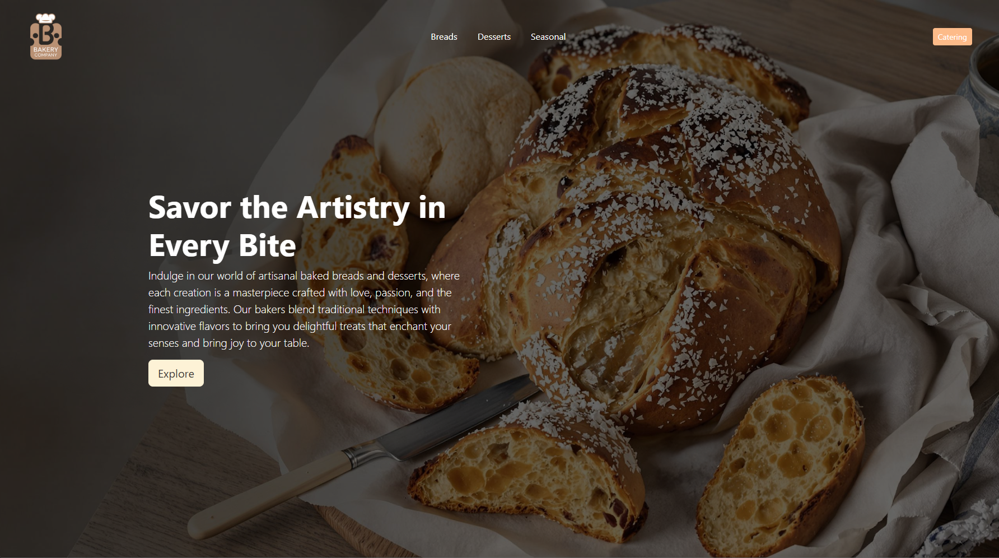
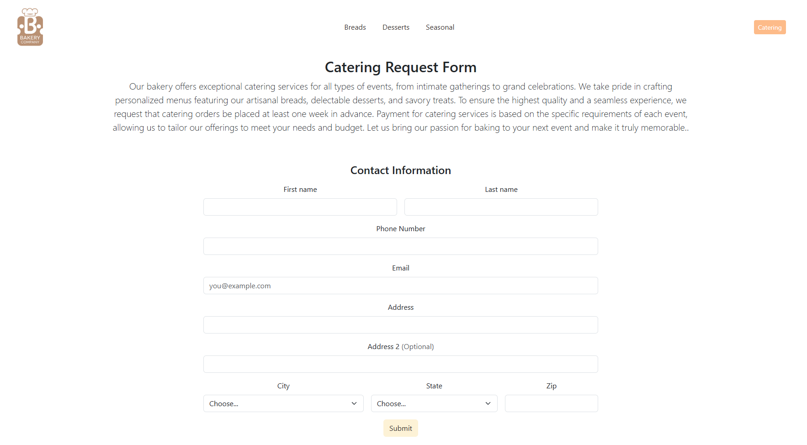

# 🍰 Bakery Website

A responsive bakery website showcasing baked goods, product listings, and a catering request form.

# Author
Andrew Soria

## 📸 Previews

### Home Page

### Product Page

### Catering Form Page

## 🚀 Features
- 🍞 **Home Page:** Displays featured baked goods and bakery highlights.
- 🛒 **Product Page:** A detailed list of available bakery products with descriptions and prices.
- 📋 **Catering Form:** Customers can submit catering requests directly from the website.
- 📱 **Responsive Design:** Optimized for desktop, tablet, and mobile devices.

## 🌐 Live Demo
Check out the live site here: [Bakery Website](https://jediwebdev.github.io/Bakery-Website/)

## 🛠️ Technologies Used
- **HTML5**
- **CSS3**
- **Bootstrap**

## 💡 Ideas for Future Improvements
1. Add a checkout page  
2. Implement JavaScript to dynamically change pages  
3. Improve the footer by adding more business information  

## 📥 Installation
No special installation is required since this is a static website. You can access it directly via the live demo link above.  

### To run it locally:
1. **Clone the repository**  
   git clone https://github.com/jediwebdev/Bakery-Website.git